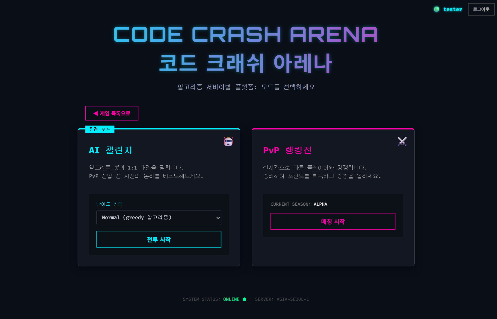
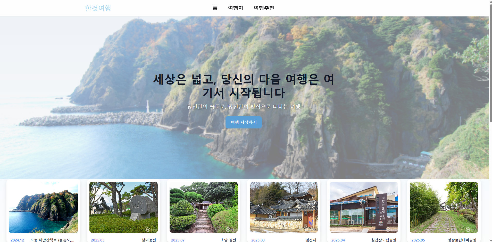

# Eunjung's Github Profile

**안정적이고 지속 가능한 시스템 구조를 고민하는 경험을 쌓아온 백엔드 개발자입니다.**

---

## 기술 스택

### Backend & Languages

### Infrastructure & Database

### Tools & Collaboration

---

## 주요 프로젝트

### 1. Code Crash Arena (실시간 1:1 알고리즘 대결 서비스)
**`Solo Project`** | **`2025.11 ~ 2025.12`** Docker 기반의 독립된 코드 실행 환경과 Redis를 활용한 실시간 매칭 시스템을 구축했습니다.

* **Key Tech**: Java 17, Spring Boot, WebSocket, Redis, Docker
    * **Race Condition 해결**: DB 기반 매칭의 병목 현상을 해결하기 위해 Redis ZSET(Sorted Set)과 Atomic Operation으로 동시성 이슈 없는 논블로킹 매칭 큐 구현
    * **안전한 코드 실행**: 사용자 코드가 서버에 영향을 주지 않도록 **Docker Container** 격리 환경에서 컴파일 및 실행되도록 파이프라인 구축
    * **좀비 세션 관리**: 네트워크 불안정 시 세션 유실 문제를 방지하기 위해 **Redis Scope(Lobby/Game)** 분리 전략 적용 및 자동 기권 처리 로직 구현

 

### 2. 한컷여행 (여행 경로 추천 및 공유 서비스)
**`(3명) Team Leader`** | **`2025.07 ~ 2025.09`** 한국관광공사 Open API를 활용하여 맞춤형 여행 경로를 생성하고 공유하는 플랫폼입니다.

* **Key Tech**: Spring Boot, JPA, MariaDB, AWS (EC2/RDS), Docker
* **My Contribution**:
    * **데이터 정규화**: API 별로 상이한 비정형 필드 구조를 분석하여 확장 가능한 통합 데이터 모델링 및 정규화 수행
    * **데이터 매칭 정확도 향상**: 관광지 식별 코드가 API마다 다른 문제를 해결하기 위해, 명칭 기반 1차 매칭 후 **위/경도 좌표 거리 알고리즘**을 적용한 검증 로직 구현
    * **인프라 구축**: AWS 환경에서 Docker 컨테이너 기반으로 배포 파이프라인 구축 및 HTTPS(Route53) 적용

 

### 3. 위드유 (AI 활용 주식 모의투자 플랫폼)
**`(4명) Team Leader`** | **`2025.03 ~ 2025.06`** 실시간 주식 시세 API와 AI 챗봇을 결합한 모의투자 서비스입니다.

* **Key Tech**: Spring Boot, Redis, GCP, Flutter
* **My Contribution**:
    * **조회 성능 최적화**: RDB(회원/거래내역)와 **Redis(실시간 시세)**로 데이터 저장소를 분리하는 **Read-Through/Write-Back** 전략 설계로 병목 현상 해소
    * **API 과부하 방지**: 증권사 API의 Rate Limit 제한(초당 20회 미만 등)을 준수하기 위해 `synchronized` 블록과 **요청 큐(Queue)**를 활용한 재요청 로직 구현
    * **AI 챗봇 파이프라인**: LLM이 JSON 포맷으로 의도(Intent)를 반환하도록 프롬프트 엔지니어링 수행, 내부 API와 연동하여 실시간 주가 정보를 답변하도록 구현

---

## GitHub Analytics

  
    

  
  
  

